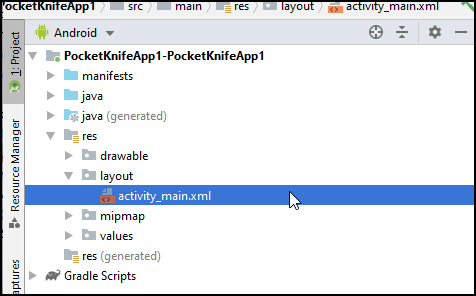
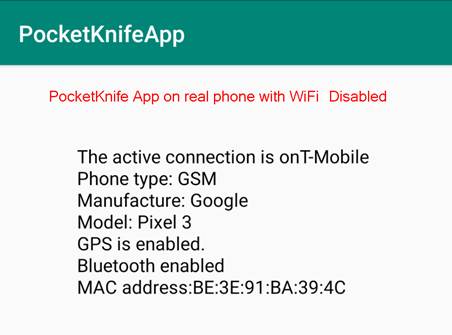
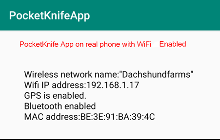

# PocketKnifeModule1-Kotlin1

dev: 
test: 
master: 

Import this module into a Android Project either an existing or new project

Steps to import the module to a new Project

- First in Android Studio create a new project with an Empty Activity

- Next name your project anything you like say, **PocketKnifeApp**

- Then start adding some configuration details into the project level build.gradle

~~~
allprojects {

    repositories {
    
        google()
        
        jcenter()
        
        maven { url "http://jitpack.io/" }  // <-- THIS MUST BE ADDED
    }
}
~~~

In the module level grade.build file add this dependency:

~~~
dependencies {

...

...

 implementation 'com.github.tompearson:PocketKnifeModule1-Kotlin1:master-SNAPSHOT'
 
}
~~~

In the resources (res) section in Android Studio

- Edit the Layout named activity_main.xml file and add this line

~~~
<TextView
        android:id="@+id/message"             <-- THIS MUST BE ADDED
        android:layout_width="wrap_content"
        android:layout_height="wrap_content"
        android:text="Hello World!"
        app:layout_constraintBottom_toBottomOf="parent"
        app:layout_constraintLeft_toLeftOf="parent"
        app:layout_constraintRight_toRightOf="parent"
        app:layout_constraintTop_toTopOf="parent" />
~~~

- Now build the project. There should be no errors.

- Finally replace the code in Java/MainActivity.kt with the code [found here](https://github.com/tompearson/PocketKnifeApplication/blob/master/PocketKnifeApp1-Kotlin1/src/main/java/com/example/PocketKnifeApplication/MainActivity.kt)

- Build the project insuring there are no errors.

The app is now ready to run in the emulator or a physical Android device

Test your app with WiFi disabled and enabled

# App with WiFi disabled

# App with WiFi enabled

 

